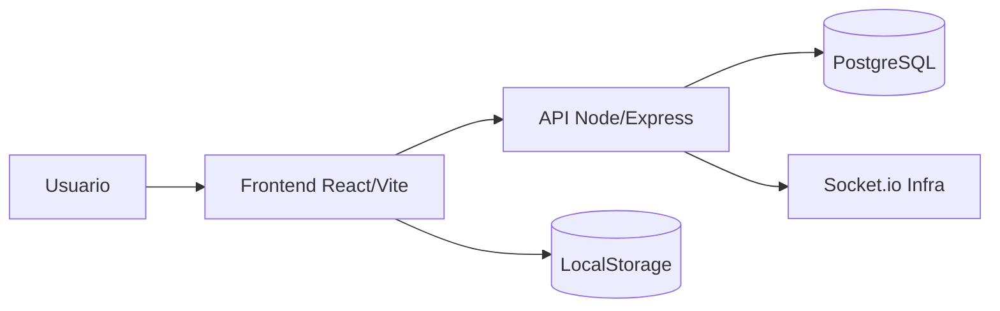

# NVX Fibra LTDA - Plataforma Operacional

Plataforma web para operacao de campo com Kanban, Agenda e colaboracao em cards.


---

## Sumario

- [Visao geral](#visao-geral)
- [Arquitetura](#arquitetura)
- [Stack](#stack)
- [Funcionalidades entregues](#funcionalidades-entregues)
- [Melhorias recentes](#melhorias-recentes)
- [Estrutura do projeto](#estrutura-do-projeto)
- [Como rodar localmente](#como-rodar-localmente)
- [Configuracao de ambiente](#configuracao-de-ambiente)
- [API e autenticacao](#api-e-autenticacao)
- [Documentacao OpenAPI](#documentacao-openapi)
- [Scripts uteis](#scripts-uteis)
- [Deploy](#deploy)
- [Roadmap tecnico](#roadmap-tecnico)
- [Observacoes](#observacoes)

---

## Visao geral

O sistema centraliza o fluxo operacional da empresa em tres frentes:

1. Kanban para ciclo de vida de cards operacionais/comerciais.
2. Agenda para organizacao de tarefas por dia, semana e mes.
3. Colaboracao em comentarios com mencoes, anexos e historico.

Objetivo pratico: reduzir retrabalho, acelerar resposta operacional e melhorar a visibilidade da execucao.

---

## Arquitetura



---

## Stack

| Camada | Tecnologias |
|---|---|
| Frontend | React, Vite, React Router, Axios, DnD Kit, React Markdown, remark-gfm |
| Backend | Node.js, Express, Sequelize, JWT, Socket.io |
| Banco | PostgreSQL |
| Persistencia local | LocalStorage (preferencias, estado de tela, agenda e configuracoes) |

---

## Funcionalidades entregues

### Autenticacao e usuarios
- Login e cadastro com validacoes alinhadas entre frontend e backend.
- Perfis de acesso aplicados (convidado, comercial, operacional, tecnico, delivery, gestor, admin).
- Painel administrativo com paginacao server-side.
- Persistencia de filtros/ordenacao/paginacao da tela administrativa.
- Access token + refresh token (rotacao via endpoint de refresh).

### Kanban
- Criacao, edicao, duplicacao, exclusao e movimentacao de cards.
- Colunas dinamicas (adicionar, editar, excluir).
- Acao de excluir todos os cards de uma coluna.
- Promocao visual de card atualizado para topo da coluna.
- Densidade visual configuravel (compacto, medio, confortavel).
- Importacao via JSON e importacao direta do Trello.
- Exportacao CSV e Excel.

### Comentarios e colaboracao
- Mencoes com notificacao e navegação ate o card mencionado.
- Hover em mencao com cartao de usuario (foto, nome, cargo).
- Comentarios com formatacao rica:
	- negrito
	- italico
	- listas
	- citacao
	- codigo
- Anexos com fluxo pendente (so envia ao clicar em Enviar).
- Imagens sem forcar nome como texto.
- PDF com abrir, baixar e imprimir.

- Modos de visualizacao: mes, semana e dia.
- Criacao de tarefa por clique direito no dia.
- Entrada rapida no dia por duplo clique.
- Modo dia com mini-cards de tarefa (titulo, horario, observacoes).
- Drag-and-drop entre status (planejado, andamento, concluido).
- Persistencia robusta de tarefas e preferencias.

### UX geral
- Skeleton loading nas telas principais.
- Melhorias de microinteracao e animacao.
- Ajustes de camadas e sobreposicao de menus.
- Branding atualizado para NVX Fibra LTDA no cabecalho.

---

## Melhorias recentes

### Backend (Últimas correções e otimizações)
- **Limite de payload** configuravel para uploads maiores.
- **Tratamento amigavel** de erro 413.
- **Correcao de persistencia** de comentarios nos cards.
- **Ajuste de associacao** Sequelize para evitar conflito de nomes.
- **Rate limiting global** parametrizavel para evitar bloqueios indevidos em dev.
- **Rotas protegidas** em cards, schedules, technicians e columns.
- **Prefixo de API** versionada em /api/v1 com health endpoints organizados.
- **OpenAPI JSON** + Swagger UI embutido (CSP + CORS configurados para unpkg.com CDN).
- **Soft-delete notifications** — sistema de notificacoes com campo `limpa` (booleano) para preservar historico.
- **Helmet CSP** otimizado para permitir recursos externos (Swagger UI).

### Frontend (Últimas correções e otimizações)
- **Menus de dados** agrupados em popover.
- **Importacao Trello** com persistencia local de configuracoes.
- **Melhorias de drag-and-drop** na Agenda e Kanban para arraste mais confortavel.
- **Drag-and-drop de cards** corrigido — cards persistem coluna corretamente (envio de `coluna_id` snake_case).
- **Scrollbar dupla** eliminada — viewport constrangida com height 100vh e overflow hidden.
- **Sidebar toggle** integrado no Header (botao arredondado no canto superior esquerdo).
- **Notificacoes** migradas para drawer fixed-position (400px de largura) com deslizamento suave.
- **Vendor field** atualizado corretamente (envio de `vendedor_id` snake_case).
- **CSS transform errors** removidos — dnd-kit transforms validados contra NaN antes de renderizar.
- **UI responsiva** e melhorias de microinteracao.

---

## Estrutura do projeto

```text
Projeto-Delivery/
	BackEnd/
		src/
			controllers/
			models/
			routes/
			middleware/
			database/
	frontend/
		src/
			components/
			pages/
			services/
```

---

## Como rodar localmente

### Requisitos
- Node.js 18+
- PostgreSQL em execucao

### Backend
```bash
API padrao: http://localhost:3000

App padrao: http://localhost:5173

npm run dev
```

Criar arquivo `BackEnd/.env` com as variaveis abaixo. Exemplo com valores padrao para desenvolvimento:
# Database  
DB_DIALECT=postgres
DB_PASS=postgres

# Frontend (usado em CORS)
FRONTEND_URL=http://localhost:5173
JWT_REFRESH_SECRET=outra_chave_muito_fraca
JWT_ACCESS_EXPIRES_IN=24h
API_BASE_PATH=/api/v1
ENABLE_LEGACY_ROUTES=true
```

**Descritive das variaveis principais:**

| Variavel | Padrao | Descricao |
|----------|--------|-----------|
| NODE_ENV | development | Ambiente (development, production, test) |
| PORT | 3000 | Porta que o servidor ouvirá |
| DB_DIALECT | postgres | Driver do banco (postgres) |
| DB_NAME | delivery_sys | Nome do banco de dados |
| FRONTEND_URL | http://localhost:5173 | URL do frontend (usado em CORS) |
| JWT_SECRET | - | Chave para assinar JWT; **DEVE SER FORTE EM PRODUCAO** |
| JWT_ACCESS_EXPIRES_IN | 24h | Tempo de expiracao do access token |
| API_BASE_PATH | /api/v1 | Prefixo de versionamento da API |
| ENABLE_LEGACY_ROUTES | true | Se true, habilita rotas sem versao (compat) |

### Frontend (.env)

Criar arquivo `frontend/.env` com:

```env
VITE_API_URL=http://localhost:3000/api/v1
```

Em producao:
```env
VITE_API_URL=https://seu-dominio.com.br/api/v1
```

### Criar banco de dados PostgreSQL

```bash
# SSH no servidor ou use pgAdmin
createdb delivery_sys
```

Apos criar o banco, executar migrations do backend:
```bash
cd BackEnd
npm run db:migrate
```

---

## API e autenticacao

### Base path principal
Todas as rotas versionadas usam prefixo: `/api/v1`

### Fluxo de autenticacao (JWT)

1. **Login:**
   ```
   POST /api/v1/users/login
   Body: { email, password }
   Response: { accessToken, refreshToken, user: { id, name, email, role, ... } }
   ```

2. **Usar em rotas protegidas:**
   ```
   GET /api/v1/cards
   Header: Authorization: Bearer <accessToken>
   ```

3. **Refresh token (quando accessToken expirar):**
   ```
   POST /api/v1/users/refresh
   Body: { refreshToken }
   Response: { accessToken, refreshToken }
   ```

4. **Logout (limpa sessao):**
   ```
   POST /api/v1/users/logout
   Header: Authorization: Bearer <accessToken>
   ```

### Rotas principais (todos requerem auth exceto /users/login e /users/register)

**Usuarios (Admin)**
- `POST /api/v1/users/login` — login
- `POST /api/v1/users/register` — registro (requireAdmin)
- `GET /api/v1/users` — listar usuarios (paginado, requireAdmin)
- `GET /api/v1/users/:id` — detalhes do usuario
- `PUT /api/v1/users/:id` — editar usuario
- `DELETE /api/v1/users/:id` — excluir usuario (requireAdmin)

**Cards (Kanban)**
- `GET /api/v1/cards` — listar cards
- `POST /api/v1/cards` — criar card
- `GET /api/v1/cards/:id` — detalhes do card
- `PUT /api/v1/cards/:id` — editar card
- `DELETE /api/v1/cards/:id` — excluir card
- `POST /api/v1/cards/:id/duplicate` — duplicar card

**Colunas**
- `GET /api/v1/columns` — listar colunas (requer auth)
- `POST /api/v1/columns` — criar coluna (requireAdmin)
- `PUT /api/v1/columns/:id` — editar coluna (requireAdmin)
- `DELETE /api/v1/columns/:id` — excluir coluna (requireAdmin)

**Comentarios**
- `GET /api/v1/cards/:cardId/comments` — listar comentarios do card
- `POST /api/v1/cards/:cardId/comments` — criar comentario
- `PUT /api/v1/comments/:id` — editar comentario
- `DELETE /api/v1/comments/:id` — excluir comentario

**Notificacoes**
- `GET /api/v1/notifications` — listar somilhar quando PATCH /clear-read
- `GET /api/v1/notifications/mine` — notificacoes do usuario logado
- `PATCH /api/v1/notifications/clear-read` — marcar notificacoes como limpa (soft-delete)

**Agenda (Schedules)**
- `GET /api/v1/schedules` — listar agendas
- `POST /api/v1/schedules` — criar agenda
- `PUT /api/v1/schedules/:id` — editar agenda
- `DELETE /api/v1/schedules/:id` — excluir agenda

**Health Check**
- `GET /api/v1/health/db` — verificar conexao com banco (sem auth)

### Observacoes importantes

- **JWT_SECRET:** Nao e o token usado em requests; e a CHAVE PRIVADA que assina os JWTs. Cada JWT assinado contem informacoes do usuario.
- **Refresh Token:** Persiste em banco e pode expirar. Se ambos expirem, usuario precisa fazer login novamente.
- **Soft-delete Notifications:** Notificacoes nao sao deletadas; apenas marcadas com `limpa: true`. Historico e preservado.
- **Rotas legadas:** Se ENABLE_LEGACY_ROUTES=true, rotas sem /api/v1 sao acessiveis (ex: GET /cards equivale a GET /api/v1/cards).

---

## Documentacao OpenAPI

Com o backend rodando:
- JSON OpenAPI: http://localhost:3000/api/v1/openapi.json
- Swagger UI: http://localhost:3000/api/v1/docs

---

## Scripts uteis

### Backend
- npm run dev
- npm run db:migrate
- npm run db:undo
- npm run db:undo:all

### Frontend
- npm run dev
- npm run build

### Raiz
- npm run dev
- npm run dev:backend
- npm run dev:frontend
- npm run dev:frontend:host

---

## Deploy

### Arquitetura de produção
A aplicacao e deployada seguindo um modelo de reverse proxy com nginx externo:

```
Internet
   |
   v
[Nginx Externo no Servidor]  <-- Gerencia SSL/TLS, dominio, certificado
   |
   v
[Aplicacao Node/Express]
   |
   v
[PostgreSQL]
```

### Setup de produção

#### Nginx Externo (Reverse Proxy)
- **Responsavel por:** gerenciamento de SSL/certificado, roteamento de dominio, balanceamento de carga
- **Configuracao:** Adicionar dominio no nginx da infra e apontar para IP interno:porta da aplicacao
- **Exemplo de uso:** dominio.com → http://IP_interno:3000
- **Certificado:** Gerenciado pelo nginx externo (usualmente Let's Encrypt automatizado)

**Nota:** Nao e necessario fazer deploy de configuracoes nginx adicionais junto com a aplicacao. Use os arquivos em `deploy/nginx/` apenas como referencia para setup local ou para entender a estrutura.

#### Backend Deployment Options

**Opcao 1: PM2 (recomendado)**
```bash
cd BackEnd
npm install
npm run db:migrate  # executar migrations
pm2 start ecosystem.config.cjs --env production
pm2 save
```

Arquivos de referencia:
- `deploy/pm2/ecosystem.config.cjs` — configuracao do PM2
- `deploy/pm2/delivery-backend.service` — integracao com systemd

**Opcao 2: Docker (alternativa)**
Se preferir containerizar, usar Docker Compose ou similar. Certificado e roteamento sao responsabilidade do nginx externo.

#### Frontend Deployment

**Static Hosting recomendado:**
```bash
cd frontend
npm install
npm run build
# Servir dist/ no servidor web (nginx, Apache, etc)
```

Ou fazer deploy junto com o backend e servir files estaticos via Express:
```bash
app.use(express.static('path/to/frontend/dist'));
```

#### Variaveis de ambiente em produção

**Backend (.env.production)**
```env
NODE_ENV=production
HOST=0.0.0.0
PORT=3000

DB_DIALECT=postgres
DB_HOST=localhost
DB_PORT=5432
DB_NAME=delivery_sys_prod
DB_USER=postgres
DB_PASS=<senha_forte>

FRONTEND_URL=https://seu-dominio.com.br

JWT_SECRET=<chave_aleatoria_forte_32+chars>
JWT_REFRESH_SECRET=<outra_chave_aleatoria_forte_32+chars>
JWT_ACCESS_EXPIRES_IN=24h
JWT_REFRESH_EXPIRES_IN=30d

API_BASE_PATH=/api/v1
ENABLE_LEGACY_ROUTES=false

MAX_REQUEST_SIZE=50mb
```

**Frontend (.env.production)**
```env
VITE_API_URL=https://seu-dominio.com.br/api/v1
```

#### Checklist pre-deploy
- [ ] .env configurado com variaveis de producao
- [ ] JWT_SECRET e JWT_REFRESH_SECRET sao valores aleatorios fortes
- [ ] Banco de dados PostgreSQL criado e acessivel
- [ ] FRONTEND_URL aponta para dominio correto com https
- [ ] Migrations executadas com sucesso: `npm run db:migrate`
- [ ] Nginx externo configurado e roteando para IP:porta correta
- [ ] SSL/certificado validado no nginx externo
- [ ] PM2 ou Docker iniciando corretamente
- [ ] Acessar endpoint de health: GET https://seu-dominio.com.br/api/v1/health/db

#### Observacoes importantes
- **Certificado SSL:** Gerenciado unicamente pelo nginx externo (nao incluso na aplicacao)
- **Rate Limiting:** Verificar limites em producao se houver muita carga
- **Logs:** Configurar rotacao de logs e monitoramento via PM2 ou Docker logs
- **Backup:** Estabelecer rotina de backup do banco PostgreSQL
- **Monitoramento:** Usar ferramentas como New Relic, DataDog ou similar para observabilidade

---

## Troubleshooting

### Backend

**Problema: "Error: listen EADDRINUSE :::3000"**
- Porta 3000 ja esta em uso
- Solucao: Matar processo existente ou trocar PORT no .env

**Problema: "Sequelize connection refused"**
- PostgreSQL desligado ou credenciais incorretas
- Solucao: Verificar .env (DB_HOST, DB_PORT, DB_USER, DB_PASS) e garantir que PostgreSQL esta rodando

**Problema: "Rate limit exceeded" em desenvolvimento**
- Rate limiter default bloqueia apos X requisions em Y tempo
- Solucao: Aumentar RATE_LIMIT_WINDOW_MS e RATE_LIMIT_MAX ou desligar em dev (verificar middleware/rateLimiter.js)

### Frontend

**Problema: "npm run dev nao inicia ou erro de port 5173"**
- Porta 5173 ja em uso
- Solucao: Usar `npm run dev -- --port 5174` ou matar processo na porta 5173

**Problema: "CORS error ao acessar API"**
- FRONTEND_URL incorreta no backend .env
- Solucao: Garantir que backend .env tem FRONTEND_URL=http://localhost:5173 (ou dominio correto)

**Problema: "Cards nao aparecem no Kanban"**
- Verificar permissoes do usuario (deve ter acesso a cards)
- Verificar se API esta retornando dados: GET /api/v1/cards
- Solucao: Inspecionar network tab do browser para ver erro especifico

**Problema: "Dragging cards causa erros CSS"**
- Ocorria quando dnd-kit retornava transform undefined/NaN
- **Status:** Corrigido — transform é validado com Number.isFinite() antes de usar
- Se ainda ocorrer: limpar cache (`npm run build`) e hard-reload do browser

### Swagger Documentation

**Problema: "GET /api/v1/docs retorna pagina branca"**
- Helmet CSP bloqueava recursos de unpkg.com
- Ou CORS nao permitia carregamento de scripts
- **Status:** Corrigido — CSP whitelist e CORS headers adicionados
- Se ainda ocorrer: 
  - Abrir console do browser (F12)
  - Procurar por erros CSP ou CORS
  - Verificar se openapi.json carrega: GET /api/v1/openapi.json

**Problema: "Swagger UI carrega mas nao mostra endpoints"**
- openapi.json pode estar vazio ou malformado
- Solucao: Acessar diretamente /api/v1/openapi.json e validar JSON

### Notificacoes

**Problema: "Notificacoes desaparecem apos F5"**
- Migrado para soft-delete (coluna `limpa` = true em vez de DELETE)
- **Status:** Corrigido — notificacoes sao preservadas com flag limpa
- Limpar notificacoes agora e PATCH /api/v1/notifications/clear-read em vez de DELETE

---

## Roadmap tecnico

### Curto prazo
- Persistencia completa em banco para Agenda (hoje parte local).
- Testes automatizados de fluxo principal (frontend e backend).
- Auditoria de eventos por card e por usuario.

### Medio prazo
- WebSocket em producao para atualizacao em tempo real ponta a ponta.
- Dashboard de metricas operacionais (tempo medio de resolucao, volume por tecnico).
- Busca fulltext em cards e comentarios.
- Permissoes granulares por recurso (definir permissoes pelo frontend).

### Longo prazo
- Mobile app nativa (React Native).
- Integracao com sistemas externos (ERP, CRM, ticketing).
- IA para sugestoes de roteamento e prioridades.
- Analytics avancada com exportacao de relatorios.

---

## Observacoes

### Seguranca
- **JWT:** Tokens sao assinados com JWT_SECRET; trocar este valor em producao para chave aleatoria forte.
- **Helmet:** Content Security Policy (CSP) configurada para permitir apenas recursos confiveis (self + unpkg.com para Swagger).
- **CORS:** CORS habilitado seletivamente — documentacao (docs, openapi.json) com access `*`, dados protegidos com restricoes de origem.
- **Auth Middleware:** Rotas protegidas requerem Authorization header com token Bearer valido.
- **Rate Limiting:** Global rate limiter em desenvolvimento parametrizavel; em producao, considerar aumentar limites ou usar rate limiter externo (nginx, CloudFlare).

### Performance
- **Database Queries:** Usar indexes nas colunas frequentemente filtradas (usuario_id, coluna_id, status).
- **Pagination:** API implementa paginacao server-side para listas longas.
- **LocalStorage:** Frontend usa localStorage para preferencias, estado de Agenda e configuracoes (reduz chamadas API).
- **Drag-and-drop:** dnd-kit otimizado com transforms CSS; evita re-renders desnecessarios.

### Desenvolvimento
- **Ambiente Local:** ENABLE_LEGACY_ROUTES=true por padrao facilitando testes com rotas sem versao.
- **Hot Reload:** Frontend tem HMR ativado por padrao (Vite); backend recarrega com nodemon.
- **Migrations:** Usar `npm run db:migrate` antes de iniciar dev; reversoes com `npm run db:undo`.
- **Branches:** Manter main, develop e feature branches separadas; merge apenas apos validacao.

### Estrutura de código
- **Modelos:** Sequelize em `src/models/`; relacionamentos definidos em index.js.
- **Controllers:** Logica de negocio isolada em `src/controllers/`; middlewares de autorizacao em cada rota.
- **Routes:** RESTful padroes com verbos HTTP (GET, POST, PUT, PATCH, DELETE).
- **Middleware:** Auth, rate limiter e handlers de erro centralizados.
- **Frontend:** Organizacao por feature (Kanban, Agenda, Admin); servicos de API centralizados em `src/services/api.js`.

### Este README descreve o estado atual implementado.
Algumas funcionalidades originalmente planejadas foram adaptadas para entregas iterativas. Para perguntas tecnicas ou bugs, consulte logs, console do browser e endpoints de health.
