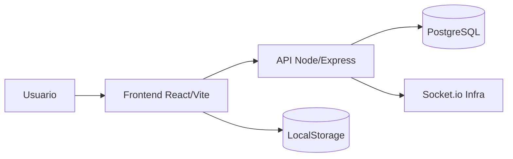

# NVX Fibra LTDA - Plataforma Operacional

Plataforma web para operacao de campo com Kanban, Agenda e colaboracao em cards.


---

## Sumario

- [Visao geral](#visao-geral)
- [Arquitetura](#arquitetura)
- [Stack](#stack)
- [Funcionalidades entregues](#funcionalidades-entregues)
- [Melhorias recentes](#melhorias-recentes)
- [Estrutura do projeto](#estrutura-do-projeto)
- [Como rodar localmente](#como-rodar-localmente)
- [Configuracao de ambiente](#configuracao-de-ambiente)
- [API e autenticacao](#api-e-autenticacao)
- [Documentacao OpenAPI](#documentacao-openapi)
- [Scripts uteis](#scripts-uteis)
- [Deploy](#deploy)
- [Roadmap tecnico](#roadmap-tecnico)
- [Observacoes](#observacoes)

---

## Visao geral

O sistema centraliza o fluxo operacional da empresa em tres frentes:

1. Kanban para ciclo de vida de cards operacionais/comerciais.
2. Agenda para organizacao de tarefas por dia, semana e mes.
3. Colaboracao em comentarios com mencoes, anexos e historico.

Objetivo pratico: reduzir retrabalho, acelerar resposta operacional e melhorar a visibilidade da execucao.

---

## Arquitetura



---

## Stack

| Camada | Tecnologias |
|---|---|
| Frontend | React, Vite, React Router, Axios, DnD Kit, React Markdown, remark-gfm |
| Backend | Node.js, Express, Sequelize, JWT, Socket.io |
| Banco | PostgreSQL |
| Persistencia local | LocalStorage (preferencias, estado de tela, agenda e configuracoes) |

---

## Funcionalidades entregues

### Autenticacao e usuarios
- Login e cadastro com validacoes alinhadas entre frontend e backend.
- Perfis de acesso aplicados (convidado, comercial, operacional, tecnico, delivery, gestor, admin).
- Painel administrativo com paginacao server-side.
- Persistencia de filtros/ordenacao/paginacao da tela administrativa.
- Access token + refresh token (rotacao via endpoint de refresh).

### Kanban
- Criacao, edicao, duplicacao, exclusao e movimentacao de cards.
- Colunas dinamicas (adicionar, editar, excluir).
- Acao de excluir todos os cards de uma coluna.
- Promocao visual de card atualizado para topo da coluna.
- Densidade visual configuravel (compacto, medio, confortavel).
- Importacao via JSON e importacao direta do Trello.
- Exportacao CSV e Excel.

### Comentarios e colaboracao
- Mencoes com notificacao e navegação ate o card mencionado.
- Hover em mencao com cartao de usuario (foto, nome, cargo).
- Comentarios com formatacao rica:
	- negrito
	- italico
	- listas
	- citacao
	- codigo
- Anexos com fluxo pendente (so envia ao clicar em Enviar).
- Imagens sem forcar nome como texto.
- PDF com abrir, baixar e imprimir.

### Agenda
- Modos de visualizacao: mes, semana e dia.
- Criacao de tarefa por clique direito no dia.
- Entrada rapida no dia por duplo clique.
- Modo dia com mini-cards de tarefa (titulo, horario, observacoes).
- Drag-and-drop entre status (planejado, andamento, concluido).
- Persistencia robusta de tarefas e preferencias.

### UX geral
- Skeleton loading nas telas principais.
- Melhorias de microinteracao e animacao.
- Ajustes de camadas e sobreposicao de menus.
- Branding atualizado para NVX Fibra LTDA no cabecalho.

---

## Melhorias recentes

### Backend
- Limite de payload configuravel para uploads maiores.
- Tratamento amigavel de erro 413.
- Correcao de persistencia de comentarios nos cards.
- Ajuste de associacao Sequelize para evitar conflito de nomes.
- Rate limiting global parametrizavel para evitar bloqueios indevidos em dev.
- Rotas protegidas em cards, schedules e technicians.
- Prefixo de API versionada em /api/v1.
- OpenAPI JSON + Swagger UI embutido.

### Frontend
- Menus de dados agrupados em popover.
- Importacao Trello com persistencia local de configuracoes.
- Melhorias de drag-and-drop na Agenda para arraste mais confortavel.

---

## Estrutura do projeto

```text
Projeto-Delivery/
	BackEnd/
		src/
			controllers/
			models/
			routes/
			middleware/
			database/
	frontend/
		src/
			components/
			pages/
			services/
```

---

## Como rodar localmente

### Requisitos
- Node.js 18+
- PostgreSQL em execucao

### Backend
```bash
cd BackEnd
npm install
# configurar .env com base no .env.example
npm run dev
```

API padrao: http://localhost:3000

### Frontend
```bash
cd frontend
npm install
npm run dev
```

App padrao: http://localhost:5173

Rodar frontend + backend juntos (raiz):
```bash
npm install
npm run dev
```

---

## Configuracao de ambiente

### Backend (.env)
Exemplo de variaveis recomendadas:

```env
NODE_ENV=development
HOST=localhost
PORT=3000

DB_DIALECT=postgres
DB_HOST=localhost
DB_PORT=5432
DB_NAME=delivery_sys
DB_USER=postgres
DB_PASS=postgres

FRONTEND_URL=http://localhost:5173

JWT_SECRET=defina_uma_chave_forte
JWT_REFRESH_SECRET=defina_outra_chave_forte
JWT_ACCESS_EXPIRES_IN=24h
JWT_REFRESH_EXPIRES_IN=30d

API_BASE_PATH=/api/v1
ENABLE_LEGACY_ROUTES=true

# Opcional para integracoes internas
SYSTEM_API_TOKEN=
```

### Frontend (.env)
```env
VITE_API_URL=http://localhost:3000/api/v1
```

---

## API e autenticacao

### Base path principal
- /api/v1

### Fluxo de auth
1. POST /api/v1/users/login
2. Recebe token (access token) + refreshToken
3. Usa Authorization: Bearer <token> nas rotas protegidas
4. Quando expirar, chama POST /api/v1/users/refresh com refreshToken
5. Para encerrar sessao, POST /api/v1/users/logout

### Observacoes importantes
- JWT_SECRET nao e token de uso em request; e a chave de assinatura do JWT.
- Rotas legadas sem /api/v1 existem por compatibilidade e podem ser desligadas via ENABLE_LEGACY_ROUTES=false.

---

## Documentacao OpenAPI

Com o backend rodando:
- JSON OpenAPI: http://localhost:3000/api/v1/openapi.json
- Swagger UI: http://localhost:3000/api/v1/docs

---

## Scripts uteis

### Backend
- npm run dev
- npm run db:migrate
- npm run db:undo
- npm run db:undo:all

### Frontend
- npm run dev
- npm run build

### Raiz
- npm run dev
- npm run dev:backend
- npm run dev:frontend
- npm run dev:frontend:host

---

## Deploy

Arquivos de apoio ja incluidos no projeto:
- deploy/nginx/delivery.nvxnetworks.com.conf
- deploy/nginx/README.md
- deploy/pm2/ecosystem.config.cjs
- deploy/pm2/delivery-backend.service
- deploy/pm2/README.md

Modelo de publicacao recomendado:
1. Frontend em https://delivery.nvxnetworks.com/
2. Backend em https://delivery.nvxnetworks.com/api/v1/
3. PM2 + systemd para manter backend sempre ativo

---

## Roadmap tecnico

- Persistencia completa em banco para Agenda (hoje parte local).
- WebSocket em producao para atualizacao em tempo real ponta a ponta.
- Auditoria de eventos por card e por usuario.
- Testes automatizados de fluxo principal (frontend e backend).

---

## Observacoes

- Este README descreve o estado atual implementado.
- Algumas funcionalidades originalmente planejadas foram adaptadas para entregas iterativas.
- Para importacao Trello, use credenciais validas com permissao de leitura do board.
